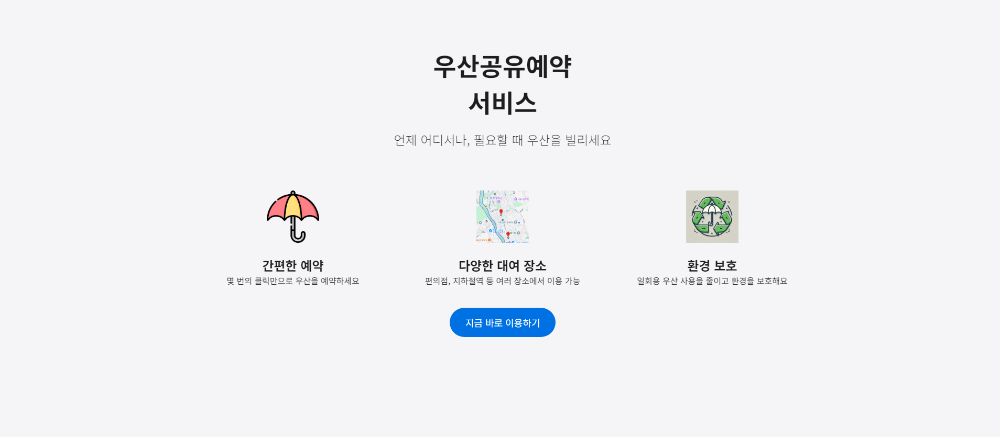
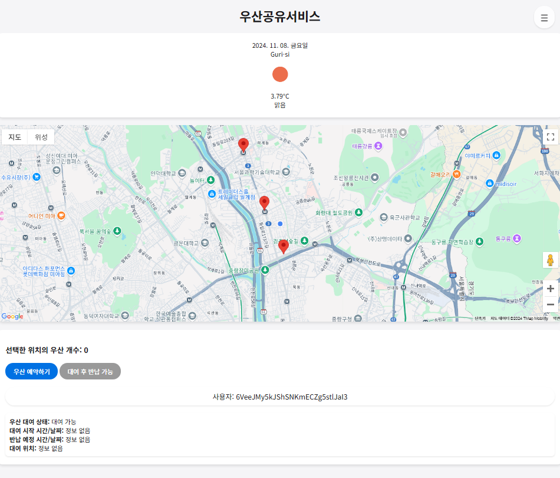
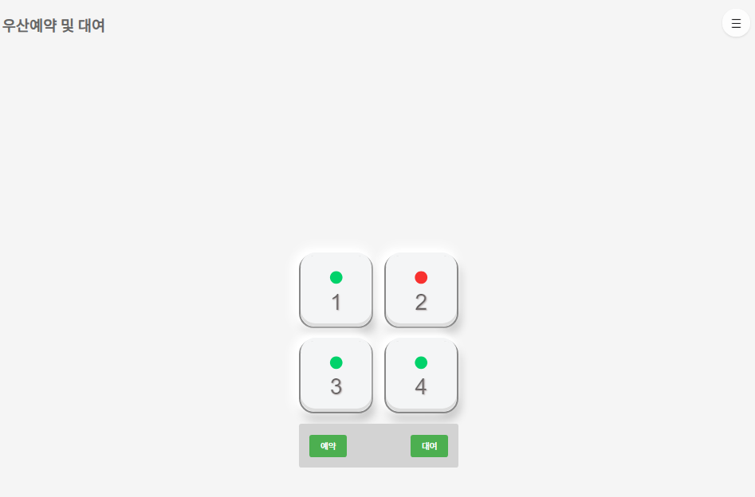
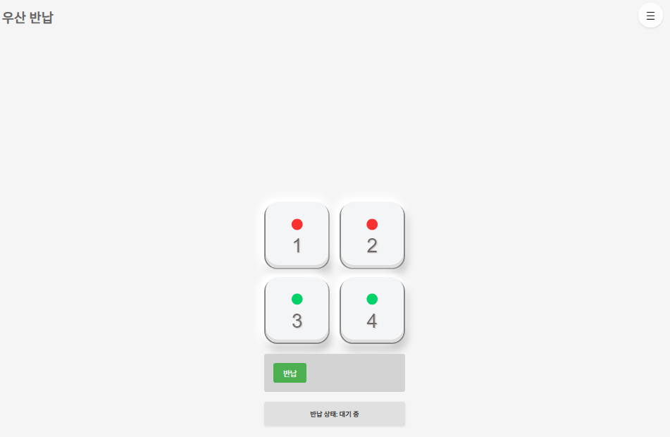
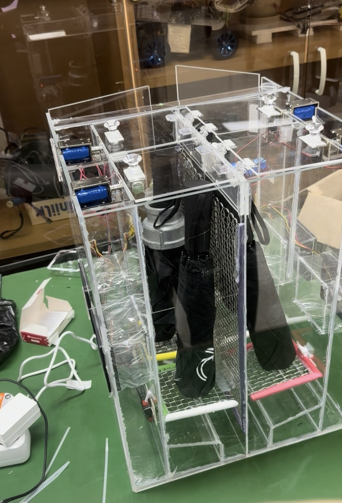

# Smart Umbrella Stand

Firebase와 Raspberry Pi를 이용한 **스마트 우산 쉐어형 시스템**입니다.
사용자는 웹사이트에서 가까운 우산 거치대의 위치와 남은 우산 개수를 확인하고, 원하는 보관함의 우산을 예약·대여·반납할 수 있습니다. 하드웨어 보관함은 Raspberry Pi를 통해 Firebase Realtime Database와 연동되며, 웹에서 발생한 대여 요청에 따라 솔레노이드 잠금장치를 제어하고 우산 유무 상태를 실시간으로 갱신합니다.

---

## 프로젝트 개요

비가 갑자기 오거나 우산을 준비하지 못한 상황에서 일회용 비닐우산을 구매하는 경우가 많습니다. 이 프로젝트는 이러한 일회용 우산 사용을 줄이고, 지하철역과 같은 공공장소에서 우산을 쉽게 빌리고 반납할 수 있도록 하기 위해 제작되었습니다.

기존 공유 서비스인 따릉이, 전동킥보드 대여 서비스처럼 우산도 필요한 순간에 가까운 장소에서 대여할 수 있도록 구성했으며, 예약 기능을 통해 사용자가 거치대까지 이동하는 동안 우산이 먼저 대여되는 상황을 줄이고자 했습니다.

---

## 주요 기능

### 1. 웹 기반 우산 대여 서비스

* 사용자는 웹사이트에서 우산 거치대 위치를 확인할 수 있습니다.
* 각 거치대에 남아 있는 우산 개수를 실시간으로 확인할 수 있습니다.
* 로그인한 사용자는 우산을 예약, 대여, 반납할 수 있습니다.
* 대여 중인 사용자는 현재 대여 상태, 대여 시작 시간, 반납 예정 시간을 확인할 수 있습니다.

### 2. 지도 및 날씨 정보 제공

* Google Maps API를 이용하여 지도 위에 우산 거치대 위치를 표시합니다.
* 사용자의 현재 위치를 기반으로 주변 거치대를 확인할 수 있습니다.
* OpenWeatherMap API를 이용하여 현재 지역의 날씨 정보를 제공합니다.

### 3. Firebase 기반 실시간 데이터 연동

* Firebase Authentication을 이용하여 회원가입 및 로그인 기능을 구현했습니다.
* Firebase Realtime Database를 이용하여 우산 보관함 상태, 대여 요청, 사용자별 대여 상태를 관리합니다.
* 웹사이트에서 대여 또는 반납 요청이 발생하면 해당 정보가 Firebase에 저장됩니다.
* Raspberry Pi는 Firebase의 대여 요청 데이터를 감지하여 보관함 잠금장치를 제어합니다.

### 4. Raspberry Pi 기반 보관함 제어

* Raspberry Pi 5를 보관함 제어 장치로 사용했습니다.
* Firebase Realtime Database의 요청 데이터를 읽어 선택된 보관함의 솔레노이드 잠금장치를 작동시킵니다.
* 푸쉬 스위치를 이용해 보관함 내부의 우산 유무를 감지합니다.
* 우산이 반납되면 냉각팬을 작동시켜 건조 기능을 수행합니다.
* 우산 상태 변화는 다시 Firebase로 업로드되어 웹사이트에 실시간 반영됩니다.

### 5. 하드웨어 보관함 기능

* 4개의 우산 보관함으로 구성
* 솔레노이드를 이용한 래치형 잠금장치
* 푸쉬 스위치를 이용한 우산 유무 감지
* 냉각팬을 이용한 우산 건조 기능
* 아크릴 구조물을 이용한 보관함 외관 제작
* 물 배출을 위한 배수로 설계

---

## 시스템 구조

```text
User
 │
 ▼
Web Page
 │
 ▼
Firebase Realtime Database
 │
 ▼
Raspberry Pi 5
 │
 ├─ Solenoid Lock
 ├─ Push Switch
 ├─ Cooling Fan
 └─ Relay Module
```

웹사이트는 Firebase를 통해 사용자 인증과 실시간 데이터 처리를 수행합니다.
Raspberry Pi는 Firebase에 등록된 대여·반납 요청을 감지하고, 해당 보관함의 솔레노이드와 센서를 제어합니다. 보관함의 상태가 변경되면 Raspberry Pi가 Firebase에 데이터를 다시 업데이트하고, 웹사이트는 변경된 상태를 사용자에게 표시합니다.

---

## 사용 기술

### Frontend

* HTML
* CSS
* JavaScript
* Google Maps API
* OpenWeatherMap API

### Backend / Database

* Firebase Authentication
* Firebase Realtime Database

### Hardware Control

* Raspberry Pi 5
* Python
* gpiozero
* firebase-admin

### Hardware Components

* Raspberry Pi 5
* Solenoid Lock `LY-03-ST`
* Cooling Fan `PLA08012B12L`
* Push Switch
* Relay Module `SRD-03VDC-SL-C`
* Acrylic Case
* 12V Battery Pack

---

## 페이지 구성

```text
web/
├─ index.html
├─ information.html
├─ login.html
├─ signup.html
├─ map.html
├─ reservation.html
└─ return.html
```

### `information.html`

우산 공유 서비스에 대한 소개 페이지입니다.
서비스의 목적, 장점, 이용 흐름을 사용자에게 안내합니다.

### `login.html`

Firebase Authentication을 이용한 로그인 페이지입니다.
로그인 성공 시 지도 페이지로 이동합니다.

### `signup.html`

회원가입 페이지입니다.
이메일과 비밀번호를 기반으로 계정을 생성하고, 사용자별 대여 상태 초기값을 Firebase Realtime Database에 저장합니다.

### `map.html`

지도와 날씨 정보를 제공하는 메인 페이지입니다.
사용자는 지도에서 우산 거치대 위치와 현재 남은 우산 개수를 확인할 수 있습니다.

### `reservation.html`

우산 예약 및 대여 페이지입니다.
보관함별 우산 상태를 확인하고, 사용자가 선택한 보관함에 대해 대여 요청을 전송합니다.

### `return.html`

우산 반납 페이지입니다.
사용자가 대여한 우산을 빈 보관함에 반납하고, 반납 완료 후 사용자 대여 상태를 갱신합니다.

---

## Raspberry Pi 제어 흐름

1. 사용자가 웹사이트에서 우산 보관함을 선택합니다.
2. 대여 또는 반납 요청이 Firebase Realtime Database에 저장됩니다.
3. Raspberry Pi가 Firebase의 요청 데이터를 감지합니다.
4. 요청된 보관함 번호에 해당하는 솔레노이드가 작동하여 잠금장치를 해제합니다.
5. 사용자가 우산을 꺼내거나 반납하면 푸쉬 스위치가 우산 유무를 감지합니다.
6. Raspberry Pi가 보관함 상태를 Firebase에 업데이트합니다.
7. 웹사이트는 변경된 우산 개수와 보관함 상태를 실시간으로 표시합니다.

---

## 프로젝트 화면


### 서비스 소개 페이지



### 로그인 페이지


### 지도 및 우산 현황 페이지



### 우산 예약 및 대여 페이지



### 우산 반납 페이지



### 하드웨어 보관함



## 시연 영상

[프로젝트 시연 영상 보기](https://youtube.com/shorts/ciJRqRCe1xQ)

---

## 프로젝트 결과

본 프로젝트를 통해 웹사이트에서 우산 보관함을 선택하고 대여를 요청하면 Firebase Realtime Database에 요청 정보가 저장되고, Raspberry Pi가 이를 감지하여 해당 보관함의 잠금장치를 해제하는 흐름을 구현했습니다.

또한 우산을 꺼내거나 반납했을 때 푸쉬 스위치를 통해 우산 유무를 판단하고, 그 결과를 Firebase에 업데이트하여 웹사이트에서 보관함 상태가 변경되는 것을 확인했습니다. 반납 시에는 냉각팬을 이용한 건조 기능도 함께 동작하도록 구성했습니다.

---

## 프로젝트 의의

이 프로젝트는 웹페이지 제작에 그치지 않고, 실제 우산 보관함 하드웨어를 직접 설계·제작하고 Raspberry Pi를 이용해 동작을 제어한 IoT 기반 공유 시스템 구현 프로젝트입니다. 아크릴 구조물로 4칸 보관함을 제작하고, 솔레노이드 잠금장치, 푸쉬 스위치 기반 우산 감지 구조, 냉각팬 건조 기능, 배수 구조를 직접 구성하여 실제 대여·반납 상황에서 동작할 수 있도록 설계했습니다.

또한 Raspberry Pi 제어 코드를 작성하여 Firebase Realtime Database의 요청을 감지하고, 사용자 요청에 따라 솔레노이드와 팬을 제어하며 보관함 상태를 실시간으로 갱신하도록 구현했습니다. 이를 통해 실제 하드웨어 제작, GPIO 기반 장치 제어, Firebase 연동, 사용자 요청에 따른 실시간 상태 갱신까지 하나의 시스템으로 구현한 경험을 쌓을 수 있었습니다.

---

## Contributors

* 김태윤
* 박원의
* 진승혁

서울과학기술대학교 전자공학과 졸업작품 프로젝트
